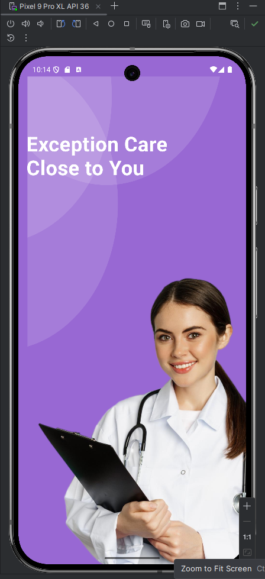
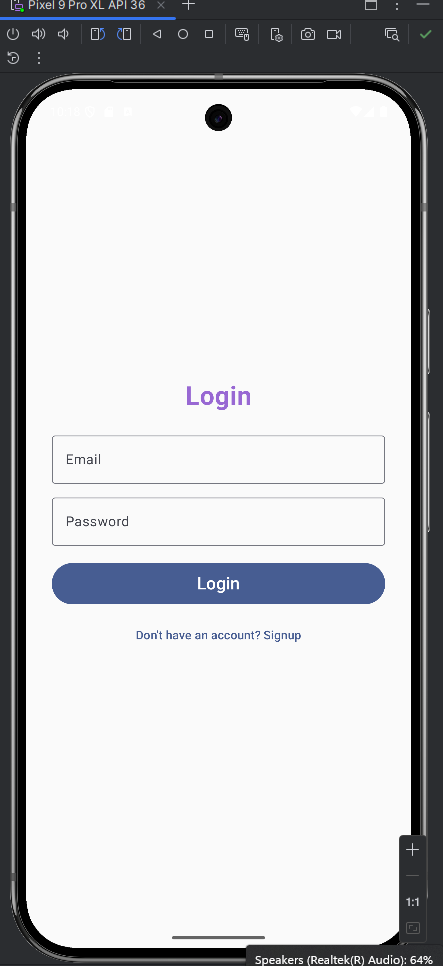
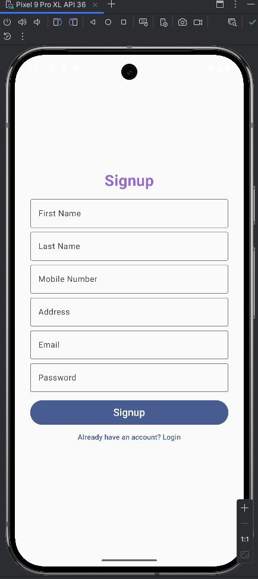
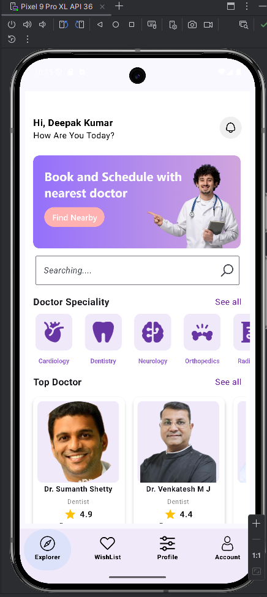
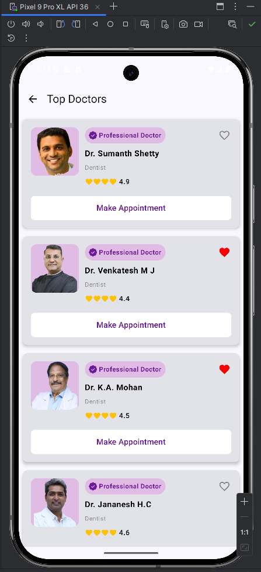
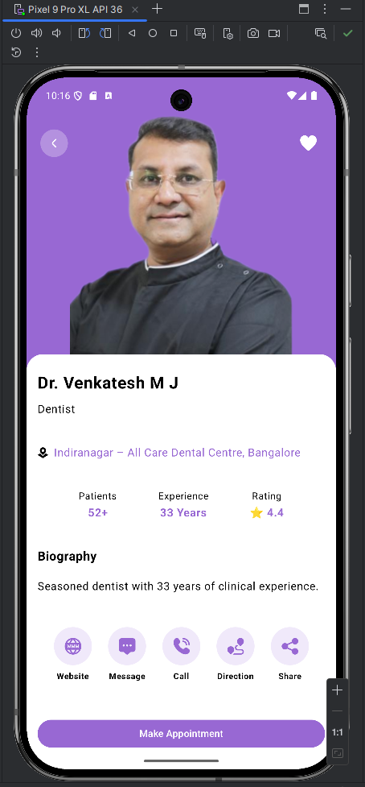
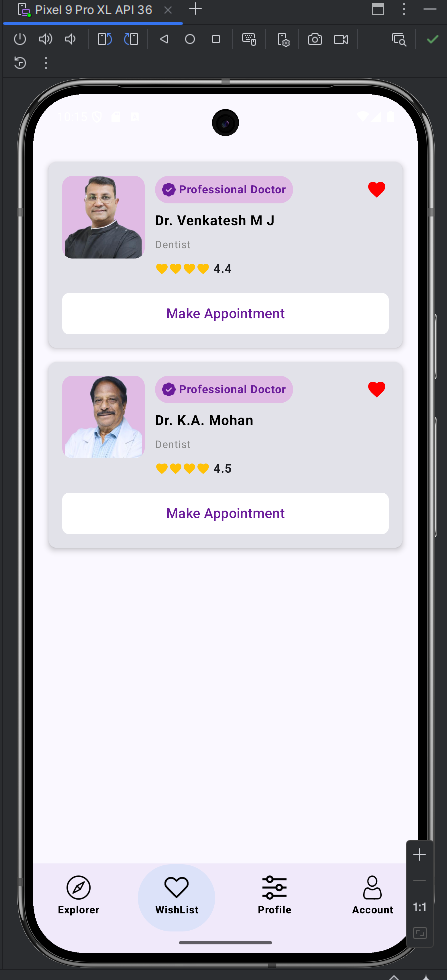

# 🏥 Doctor Appointment App (In Progress)

An Android app built using Kotlin + Jetpack Compose to help users book appointments with doctors near them. It includes modern UI, Firebase integration, and real-time features.

---

## ✨ Features

- 📱 Splash, Login & Signup UI
- 🔐 Firebase Authentication
- 👨‍⚕️ Explore Doctor Profiles by Specialty
- ❤️ Add to Wishlist
- 💾 MVVM Architecture with Clean UI

---

## 🖼️ App Screenshots

### 🚀 Splash Screen

### 🔐 Login Screen

### 📝 Signup Screen

### 🏠 Home Screen

### 👨‍⚕️ Top Doctors

### 📄 Doctor Detail Screen

### ❤️ Wishlist Screen

---

## 🛠️ Tech Stack

- Kotlin
- Jetpack Compose
- Firebase Auth + Firestore
- MVVM Architecture
- Android Studio

---

## ⚠️ Notes

- This is a **partial build** for academic purposes.
- Firebase `google-services.json` file is excluded for security reasons.
- To run this project, you must:
  1. Create a Firebase project
  2. Add `google-services.json` in the `/app` folder
  3. Enable Email/Password Authentication

---

## 📬 Contact

**Deepak Kumar**  
📧 [your-email@example.com]  
🌐 [GitHub Profile](https://github.com/your-username)
